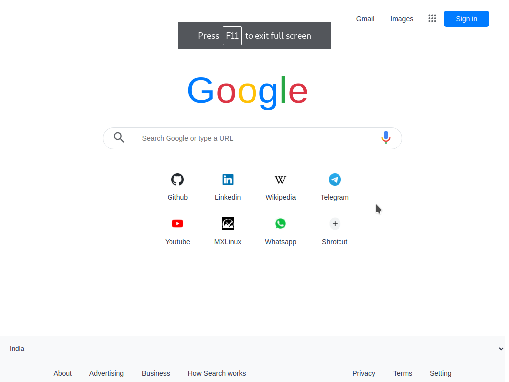

# Clone-2

- Name : "Google"

- Description : "try to copy Google ui just of practice"

- Version : 2.1

- Update : 29-08-2023

- Status : REST

- Responsive : True

- TecStack : { HTML | CSS | JavaScript }

- Thanks : { VSCode | GitHub | GIMP | Google }

- Work : Self

- Design : { Mayank }

- Developer : { Mayank }

- CopyRight : { Google }

- URL : https://mayankdevil.github.io/clone-2/

- Clone : https://github.com/MayankDevil/clone-2.git

- Download : https://github.com/MayankDevil/clone-2/archive/refs/heads/main.zip

---

### Home Page

## NOTE

_this repository is the clone of **Google**. I am just try to copy and develope to make better version as my imagination because i am developer_S

